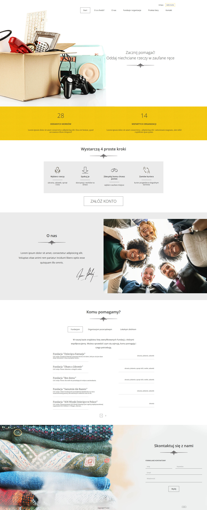

# Oddam W Dobre Rece

Celem projektu było stworzenie miejsca, w którym każdy będzie mógł oddać niepotrzebne rzeczy zaufanym instytucjom.

## Skąd pomysł na projekt

- Użytkownik ma w domu rzeczy, których chce się pozbyć, ale nie wie jak.
- Jest wiele dostępnych rozwiązań, ale wiele z nich wymaga dodatkowego wysiłku lub nie ma do nich zaufania. W zweryfikowane miejsca trzeba pojechać, a nie ma na to czasu/ nie ma jak tam pojechać, a kontenery pod domem lub lokalne zbiórki są niezweryfikowane i nie wiadomo czy te rzeczy faktycznie trafią do potrzebujących.

## Aby uruchomić lokalnie

  1. Stworzyć wirtualne środowisko Pythona 3.8
  2. Zainstaluj wszystkie biblioteki:  `pip install -r requirements.txt`
  3. Utwórz plik „local_settings.py” w katalogu o nazwie „charitydonation”, zawierający konfigurację DATABASES.
  4. Stwórz tabele `python manage.py migrate`
  5. Stwórz superuser `python manage.py createsuperuser`
  6. Wreszcie, uruchom server `python manage.py runserver`

Prototyp projektu został przygotowany przez CodersLab.

